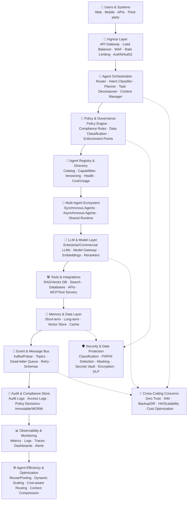
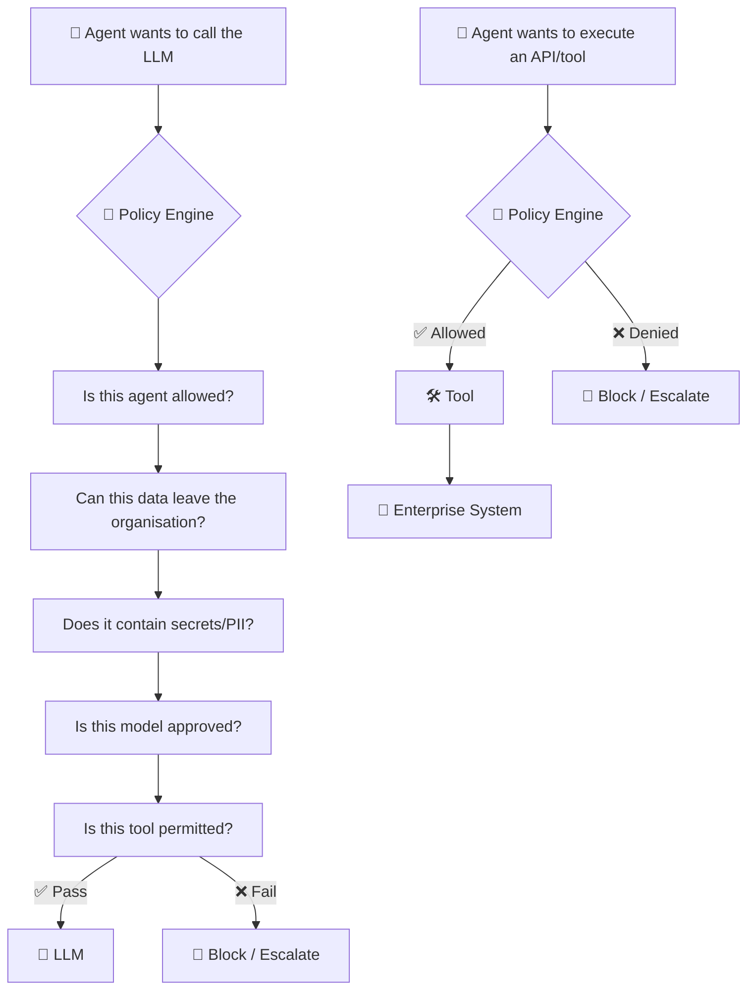
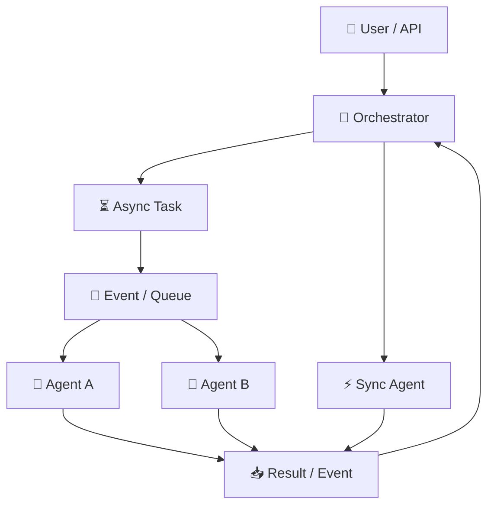
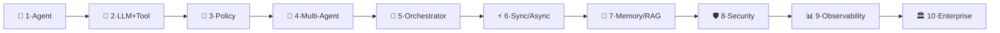
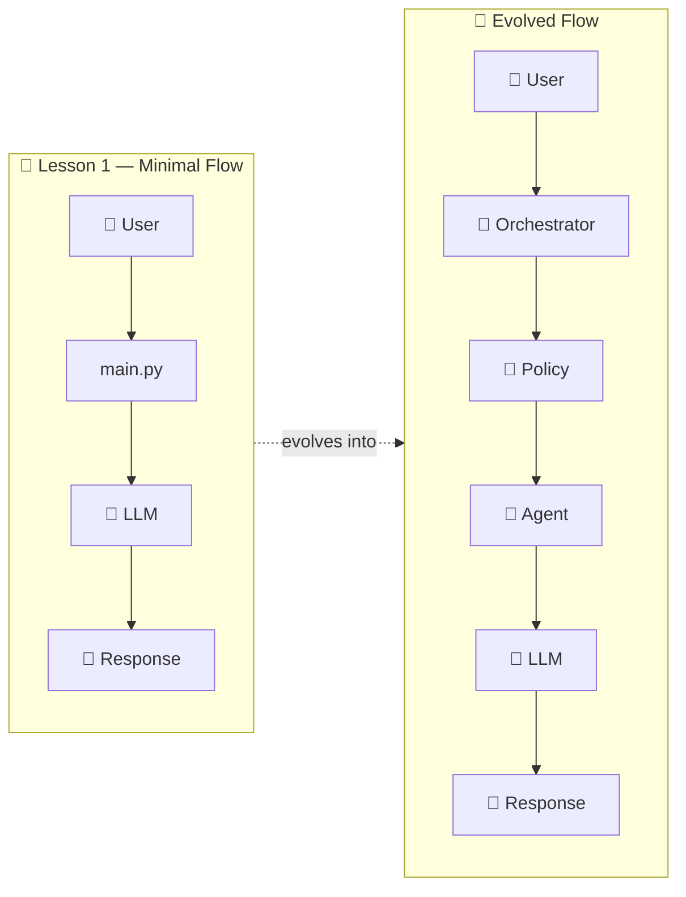

# 🏢 Enterprise Multi-Agent Platform — Learning Notes

## 🎯 Project Overview

We're building a **mature enterprise multi-agent AI platform** — not a demo or a simple chatbot. The target architecture (below) is our master blueprint, and we build toward it progressively.

- **Working folder:** `enterprise-multi-agent/`
- **Recommended package/product name:** `enterprise-multi-agent-platform` (chosen over `multi-agent-demo` because the end goal is the full architecture, not a toy)
- **Stack for Lesson 1:** Python + LangGraph + LangChain + OpenAI SDK — LangGraph gives us the orchestration foundation for sync/async multi-agent workflows later.

> We will **not** build all of this on day one. We keep the VS Code project extremely small and add each folder/component only when we reach the architecture block that needs it.

---

## 📖 Teaching Approach

For every block in the architecture, the lesson follows the same rule:

**`WHY → WHAT → HOW → CODE → TEST → WHERE IT FITS IN THE DIAGRAM`**

Each block is tested before moving to the next, so by the end you can point at any box in the diagram and explain what it does and why it exists.

---

## 🏛️ Master Architecture

This is the full target platform — every layer we'll eventually build.



---

## 🔐 Policy Enforcement Flow

Policy is **not** an optional folder the agent consults — it sits directly between agent intent and any sensitive action (LLM call or tool call).



---

## ⚡ Synchronous vs Asynchronous Orchestration



This lets us learn *when* synchronous execution is appropriate vs. *when* asynchronous is better, instead of calling everything "an agent."

---

## 🛡️ Security & Governance Principles

The security/policy layer is never an afterthought. The platform must explicitly control:

- ✅ What data an agent can access
- ✅ What information can be sent to an LLM
- ✅ Which LLM/model can be used
- ✅ Which tools an agent can invoke
- ✅ Secrets / API keys
- ✅ PII / Confidential / Restricted data
- ✅ Authorization
- ✅ Audit trails
- ✅ Policy decisions
- ✅ Cost and token usage

---

## 🗺️ Build Roadmap

We build incrementally — never the full architecture on day one.

| Phase | Focus | Key Topics |
|:---:|---|---|
| 1 🌱 | One Agent | First simple agent, environment setup |
| 2 🔧 | LLM + Tool | Tool-enabled agents |
| 3 🔐 | Policy | Data classification, secrets/PII protection, enforcement before every LLM/tool call |
| 4 🤝 | Multiple Agents | Specialist agents, agent routing |
| 5 🧭 | Supervisor / Orchestrator | Agent-to-agent communication |
| 6 ⚡ | Sync + Async | Synchronous vs. asynchronous flows |
| 7 💾 | Memory + RAG | Short-term & long-term memory, vector DB |
| 8 🛡️ | Security + Secrets | Secrets management, encryption |
| 9 📊 | Observability + Audit | Metrics, logs, traces, audit trails, human approval, retry/error handling |
| 10 🏛️ | Enterprise Architecture | Async messaging, queues/events, API gateway, deployment, model selection, context/token efficiency |



---

## 📁 Project Structure

**Starting point (Lesson 1) — nothing more:**

```
enterprise-multi-agent-platform/
│
├── .env
├── .gitignore
├── requirements.txt
└── main.py
```

**Grown incrementally, later, one folder per architecture block reached:**

```
agents/         orchestration/   policies/
security/       models/          tools/
memory/         events/          observability/
audit/          api/             config/
tests/
```

Each folder is introduced only when its corresponding architecture block is taught — never pre-created.

---

## 🚀 First Objective Flow



---

## ✅ Immediate Next Step — Block 1: VS Code Foundation

Only what's needed to start:

- Python 3.11 / 3.12
- VS Code
- Python virtual environment
- `python-dotenv`
- OpenAI SDK

**Not needed yet:** LangGraph, Kafka, Redis, Chroma, PostgreSQL, FastAPI, MCP — each is added only when its architecture block is reached.

**Action:** create the `enterprise-multi-agent-platform` VS Code project, set up the Python virtual environment, install only the minimum foundation libraries — then stop and understand what was built before moving to Block 2.
